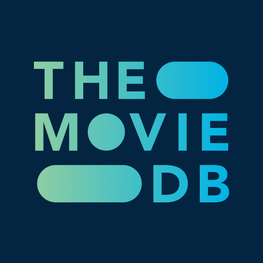

# AI Movie Advisor
*Chat with a virtual AI chatbot and get movie recommendations based on your watch history and preferences.*

# Description
This project explores the possibilities of Langchain [Tools](https://python.langchain.com/v0.1/docs/modules/tools/) and [Agents](https://python.langchain.com/v0.1/docs/modules/agents/) to build a RAG (Retrieval Augmented Generation) pipeline, allowing the LLM to get information it has not been trained on: user's watch-history, movie preferences, upcoming film releases, etc.

# Schematic
Here is an schematic of the project. The pipeline is built around the Agent, which is handling all communications between user and LLM at all times, providing prompt and tool-enhanced information.


+ The *ai_chatbot* submodule initializes an agent, based on the prompt jsonl file and tools module defined in config.
+ The user interacts with the agent with voice messages, which are going through *GoogleWeb STT* engine and transformed into text.
+ The LLM decides, based on the list of available tools and their description, which ones should be used to enhance the prompt with related information.
+ The LLM provides an answer based on prompt, user query and enhanced context when needed.
+ The text answer is going through *Edge TTS* engine and returned to the user as a voice message.


# Installation

Create a virtual environment and install modules listed in requirements.txt as follows.
```bash
git clone https://github.com/alexdjulin/movie-advisor.git
cd movie-advisor
python -m venv .venv
.venv/Scripts/activate.bat
pip install -r requirements.txt
```

Rename `.env_template` in `.env`. Add missing api-keys and tokens to it (see [Prerequisites](#prerequisites) below).

# Use voice to talk to the model

If you want to talk to the model using speech, like in the demo, you need to initialize the [ai_chatbot](https://github.com/alexdjulin/ai_chatbot) submodule and install the required modules too.

```bash
git submodule add https://github.com/alexdjulin/ai_chatbot.git ai_chatbot  # if .gitmodules is missing
git submodule update --init --recursive  # if ai_chatbot specified in .gitmodules
pip install -r ai_chatbot/requirements.txt  # install ai_chatbot requirements
```

Copy `config.yaml` from root folder inside the `ai_chatbot` folder to configure it for this project.

# Prerequisites

To run the project, you will need the following:  


An [OpenAI API-Key](https://platform.openai.com/api-keys). You can create one for free using your google account and use the starter credit to try it out. Once generated, paste your API key in the `.env` file (root folder) and in `config.yaml` (ai_chatbot folder).


Install [Xata](https://xata.io/) and get an api-key. See the [Installation](https://xata.io/docs/getting-started/installation) page for that. Once you have your API key and a database url, paste them in the `.env` file.



A TMDB account. To access the API, you will need to register for an API key. See [Getting Started](https://developer.themoviedb.org/docs/getting-started) page. Once you have your API key, paste it in the `.env` file.

Your `.env` file should look like this:
```env
OPENAI_API_KEY=your_openai_api_key
XATA_API_KEY=your_xata_api_key
XATA_DATABASE_URL=your_xata_database_url
TMDB_BEARER_TOKEN=your_tmdb_api_key
```

Don't forget to never commit any credentials to your repositories! As a security, both `.env` and `config.yaml` files are added to `.gitignore`.

# Project Set-up
If using the ai_chatbot submodule, like in the demo, you need to make sure that the paths listed in `config.yaml` are pointing to the correct prompt and tools.

The prompt should be `prompt_advisor.jsonl` and the tools `tools.py` from the root folder. Be careful that there are additional `prompt.jsonl` and `tools.py` files inside ai_chatbot, that are used when demoing this repo.

```yaml
prompt_filepath: ../prompt_advisor.jsonl
tools_filepath: ../tools.py  
```

In `config.yaml` you have access to a wide range of settings to configure your chatbot quickly without having to edit the code. See the comments for a quick description. You can create multiple config presets and specify which one to use as argument when calling main. See [Run Project](#RunProject) below.

# Run Project

You can run a simplified version of the advisor, without using the ai_chatbot submodule, by calling `main_text.py`. The agent is initialized in the main file and you can interact with it using text input/output. This is a good example of how easy it is to implement a langchain agent with RAG capabilities.

```bash
python main_text.py
```

If you want to use the ai_chatbot submodule, like in the demo, use `main_chatbot.py`. This will create an instance of the AiChatbot class, initialise a langchain agent using prompt and available tools and setup STT and TTS engines to converse with the chatbot using voice messages. You will need a microphone for this.

You can start a chat instance as follows, and pass the same optional arguments. See the ai_chatbot [Readme](https://github.com/alexdjulin/ai_chatbot) for more information.

```bash
# run with default settings
python main_chatbot.py

# specify a different name or path to config file
python main_chatbot.py --config "C:\Project\config.yaml"

# overrides input method, valid are {text, voice or voice_k}. See config.yaml.
python main_chatbot.py --input text

# overrides chat language (should be defined in config.yaml edgetts_voices).
python main_chatbot.py --language de-DE

# combined arguments, short options
python main_chatbot.py -i voice -l fr_FR
```

# Issues and Limitations

Hier is a non exhaustive list of limitations I noticed when chatting with my movie advisor.  
Feel free to reach out and help me solve these :)

## Prompt Issues:
In general, the LLM is acknoledging and resprecting prompt guidelines accurately. I had to rephrase some of them to get better results.  

The only problematic one is: `Always check my watch history and never recommend a movie that is already on one of my lists.`  
The LLM almost never queries my watch lists from xata and therefore tends to recommend movies we already talked about. 

I tried to add my movie history as a placeholder with every query: The LLM then knows exactly the content of each list and avoid recommending the same movies (although it still happens sometimes). But this leads to another issue: The model gets lazy and does not query the database anymore. If I ask why I liked or disliked a movie, it starts hallucinating and inventing a reason, instead of doing a vector search and retrieving the real reason.

## Tools Issues:
The LLM is understanding and using the tools as expected. I noticed how important the tool methods name and docstrings are important, so the LLM understand what they should be used for.

I had some issues when the LLM answers that it will update the watch lists, but eventually does not call the matching tools (liar!). I had to ask again explicitely:   
`Could you add it to my watch lists?`   
`Could you update my movie history?`

## Speech Issues:
Those issues relate to the ai_chatbot speech engines. I am using GoogleWeb Speech-To-Text and Edge-tts Text-To-Speech engines to offer voice conversation. Both are free, lightweight and offer low-latency conversations. However, they do not offer a multi-lingual support.  
+ When querying a French movie title, the STT engine still thinks that I'm speaking in English and incorectly interprets it.
+ Same issue when the LLM recommends a French movie, Edge-TTS reads the title with a strong english accent.

This issue could be fixed by implementing multi-lingual solutions (like Elevenlabs).
